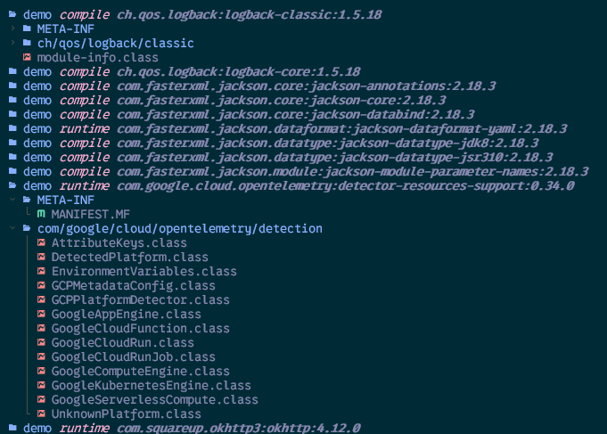

# Maven dependency extension for [Neotree](https://github.com/nvim-neo-tree/neo-tree.nvim)

## Purpose

[nvim-jdtls](https://github.com/mfussenegger/nvim-jdtls) is perfect to code and use [eclipse-jdtls](https://github.com/eclipse-jdtls/eclipse.jdt.ls) LSP.
We can easily access to .class decompiled content threw fzf.

But in some cases, i needed to scrub into a jar content to get more details about how the library is done (i.e : spring properties, spi ...) or which classes does the library provides in surrounding packages.



## Commands

* `:MavenDependenciesInvalidate` — reload the dependency cache.

## Installation

Requires Neovim >= 0.10 (uses `vim.system` for non-blocking dependency loading).

Required dependencies:
* `mvn` (or a `mvnw`/`mvnw.cmd` wrapper at the project root, auto-detected)
* `jar` (ships with any JDK — already required to run `mvn`/jdtls)
* optionally [nvim-notify](https://github.com/rcarriga/nvim-notify) for an in-place progress notification while dependencies load

No other OS-specific tool (`sh`, `unzip`, `awk`...) is required; the plugin works on Linux, macOS and Windows.

### Overriding the resolved commands

By default:
* `mvn_cmd` resolves to `./mvnw` (or `./mvnw.cmd` on Windows) if present at the project root, else falls back to `mvn` on `$PATH`.
* `jar_cmd` resolves to `$JAVA_HOME/bin/jar` if `$JAVA_HOME` is set and executable, else falls back to `jar` on `$PATH`.

Both can be overridden explicitly:

```lua
opts.maven = {
	mvn_cmd = "/opt/maven/bin/mvn",
	jar_cmd = "/opt/jdk-21/bin/jar",
	-- ...
}
```

> Using Lazy:
```lua
return {
	"nvim-neo-tree/neo-tree.nvim",
	-- branch = "v3.x",
	dependencies = {
		"nvim-lua/plenary.nvim",
		"tcordel/neo-tree-maven-dependencies.nvim",
	},
	opts = function(_, opts)
		table.insert(opts.sources, "maven")
		opts.maven = {
			window = {
				mappings = {
					["I"] = "invalidate",
				},
			},
			group_dirs_and_files = true, -- when true, empty folders and files will be grouped together
			group_empty_dirs = true, -- when true, empty directories will be grouped together
			renderers = {
				directory = {
					{ "indent" },
					{ "icon" },
					{ "name" },
				},
				file = {
					{ "indent" },
					{ "icon" },
					{ "name" },
				},
			},
		}
	end,
}
```

## Usage

`Neotree maven`: will open the dependency list. A dependency analysis will be processed on the first opening

To invalidate, simply push `I` in the list
